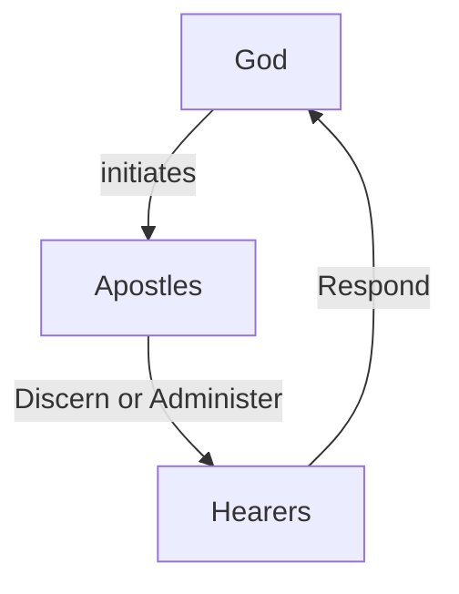

# Forgiveness in Scripture

Forgiveness in Scripture includes God’s pardon of guilt, release from personal debt, restored fellowship and several related acts. These ideas overlap, but they are not interchangeable. This article follows primary biblical patterns before considering language, commissioned ministry, church claims and modern practice.

## English and Biblical Concepts

Modern English provides useful starting distinctions. [Merriam-Webster defines forgiveness](https://www.merriam-webster.com/dictionary/forgiveness) around forgiving, while its entries for [atonement](https://www.merriam-webster.com/dictionary/atonement), [reconciliation](https://www.merriam-webster.com/dictionary/reconciliation), [righteousness](https://kingdom.ofgod.info/life/righteousness) and [sanctification](sanctification.md) describe related but different concepts. English definitions do not control biblical usage, but they help prevent one term from absorbing all the others.

| Concept                   | Biblical function                                                             | Relationship to forgiveness                                                                                                                     |
| ------------------------- | ----------------------------------------------------------------------------- | ----------------------------------------------------------------------------------------------------------------------------------------------- |
| **Atonement**             | Deals with impurity, guilt or covenant breach through a means God appoints.   | In Torah, atonement may precede the statement “he shall be forgiven”; the terms are related, not identical.                                     |
| **Forgiveness or pardon** | Releases or does not count guilt or debt against the offender.                | It answers liability, but may leave temporal consequences.                                                                                      |
| **Salvation**             | God’s wider rescue from danger, sin and death into covenant life.             | Forgiveness belongs to salvation, but salvation is broader than pardon.                                                                         |
| **Righteousness**         | Right conduct, right standing or a favourable judgement according to context. | A pardoned person is not thereby said to have performed every righteous act; pardon and acquittal must not be collapsed into moral achievement. |
| **Sanctification**        | Being set apart for God and formed in holy conduct.                           | It concerns consecration and changed life, not merely cancellation of past guilt.                                                               |
| **Reconciliation**        | Restored peace or relationship after hostility or breach.                     | Forgiveness can open the way, but trust and mutual relationship may still require repentance, repair and safety.                                |

The distinctions are causal as well as lexical. Atonement may be God’s appointed means, pardon the resulting release from guilt, reconciliation the repair of relationship, and sanctification the continuing holy life. Scripture must determine the relation in each passage.

## Language in Context

The following glosses are starting points for reading occurrences, not definitions imposed on every verse.

| Language | Form                     | Common English translation      | Contextual range relevant to forgiveness                                                            |
| -------- | ------------------------ | ------------------------------- | --------------------------------------------------------------------------------------------------- |
| Hebrew   | סלח (*sālaḥ*)            | Forgive                         | Pardon or forgive, commonly with God as subject.                                                    |
| Hebrew   | נשא (*nāśāʾ*)            | Lift, carry, bear               | Lift, carry or bear; with guilt or sin, context may express bearing it or taking it away.           |
| Hebrew   | כפר (*kippēr*)           | Make atonement                  | Make atonement, purge or effect cleansing according to ritual and object.                           |
| Hebrew   | מחה (*māḥâ*)             | Wipe out, blot out              | Wipe or blot out, including the image of erased transgression.                                      |
| Hebrew   | כסה (*kāsâ*)             | Cover, conceal                  | Cover or conceal; Psalm 32 uses covering as an image associated with forgiven sin.                  |
| Hebrew   | עבר (*ʿābar*)            | Pass over                       | Pass or pass over; in a fitting construction it can portray passing over transgression.             |
| Syriac   | ܫܒܩ (*šbq*)              | Leave, release, forgive         | Leave, release or forgive. It represents forgiveness language as later Syriac translation evidence. |
| Greek    | ἀφίημι (*aphiēmi*)       | Release, leave, permit, forgive | Release, leave, permit or forgive. Object and setting determine the sense.                          |
| Greek    | χαρίζομαι (*charizomai*) | Give graciously, grant, pardon  | Give graciously, grant or pardon. Context, not the word’s history, establishes gracious pardon.     |
| Greek    | ἀπολύω (*apolyō*)        | Release, dismiss, set free      | Release, dismiss or set free; Luke 6:37 uses it contextually for forgiving or releasing.            |

Pardon, bearing, atonement, blotting, covering and passing over are related images, not interchangeable synonyms. The Greek verbs have no hierarchy of stronger and weaker forgiveness. *Charizomai* is not a superior grade of forgiveness, and *apolyō* does not lexically mean “revenge”. No doctrine of merit or lack of merit follows from a word’s origin alone.

Corpus checks should compare forms and contexts through [STEP Bible](https://www.stepbible.org/) and [SHEBANQ](https://shebanq.ancient-data.org/) for biblical Hebrew, the [Comprehensive Aramaic Lexicon](https://cal.huc.edu/) for Aramaic, [Dukhrana](https://www.dukhrana.com/lexicon/) for Syriac Peshitta evidence, and [Perseus](https://www.perseus.tufts.edu/hopper/morph) for Greek morphology. These tools support contextual study; they do not replace analysis of the passage.

## Scriptural Pattern

Scripture presents a recurring moral and covenant pattern.

1. **Offence is exposed.** God names sin rather than treating pardon as denial (Exodus 34:7; Isaiah 1:16-17).
2. **The offender confesses.** Leviticus 5:5-6 joins confession to the prescribed offering. David acknowledges rather than conceals sin in Psalm 32:1-5 and Psalm 51. Proverbs 28:13 contrasts concealment with confession and forsaking.
3. **The offender repents and turns.** Deuteronomy 30:1-3 connects return to the LORD with restoration. Isaiah 55:6-7, Jeremiah 31:18-20, Joel 2:12-13 and Micah 7:18-19 place mercy beside return to God. Confession acknowledges the wrong; repentance turns from it and changes conduct.
4. **Atonement is made where God prescribes it.** Leviticus 4:20,26,31,35 repeatedly says that the priest makes atonement and the offender is forgiven. Leviticus 16:30-34 applies cleansing and atonement to Israel’s annual [Day of Atonement](https://kingdom.ofgod.info/christ/body/feasts/atonement).
5. **Restitution repairs measurable harm.** Leviticus 6:1-5 and Numbers 5:6-8 require restoration plus an added fifth. Zacchaeus later confirms the moral direction by offering substantial restitution (Luke 19:8).
6. **God grants pardon.** The LORD is “**forgiving iniquity and transgression and sin**” while not treating guilt as harmless (Exodus 34:6-7, ESV). Isaiah 43:25 attributes blotting out transgressions to God himself.
7. **Consequences may remain.** After the LORD says, “I have **pardoned**, according to your word,” the rebellious generation still does not enter the land (Numbers 14:20-23).
8. **Restoration may follow.** Deuteronomy 30:1-3 anticipates gathered restoration. Jeremiah 31:31-34 joins the new covenant, knowledge of the LORD and remembered sin no more.

> [!WARNING]
> This Scriptural Pattern is not a mechanical formula, and not every passage states every stage.

Isaiah summarises the movement without reducing it to ritual:

> “**Wash yourselves; make yourselves clean**; remove the evil of your deeds from before my eyes; **cease to do evil, learn to do good**; seek justice, correct oppression” — Isaiah 1:16-17 (ESV)
>
> “though your sins are like scarlet, they shall be **as white as snow**” — Isaiah 1:18 (ESV)

The order protects several truths:

* **Forgiveness** is **mercy** rather than pretence.
* **Repentance** is a **real turning**.
* **Restitution repairs** harm.
* **Atonement** is used **only where God appoints it**.
* **Pardon** does not guarantee removal of every consequence.

## Receiving Forgiveness, Salvation and Righteousness

**God initiates mercy**. Exodus 34:6-7 grounds forgiveness in the LORD’s character. Isaiah 43:25 says that God blots out transgressions “for my own sake”, not because an offender can purchase pardon.

The ordinary human response is **honest confession** and **returning to God** by forsaking sin. Psalm 32:1-5 moves from silence to acknowledged sin and divine forgiveness.

> A Maskil of David.
>
> Blessed is the one whose transgression is forgiven, whose sin is covered.  
> Blessed is the man against whom the LORD counts no iniquity, and in whose spirit there is no deceit.
>
> For when I kept silent, my bones wasted away through my groaning all day long. For day and night your hand was heavy upon me; my strength was dried up as by the heat of summer.
>
> Selah
>
> I acknowledged my sin to you, and I did not cover my iniquity;
> I said, "I will confess my transgressions to the LORD," and you forgave the iniquity of my sin.
>
> Selah
>
> — Psalm 32:1-5 (ESV)

Proverbs 28:13 joins confession with forsaking:

> Whoever conceals his transgressions will not prosper, but he who confesses and forsakes them will obtain mercy. — Proverbs 28:13 ESV

Isaiah 55:6-7 promises compassion and abundant pardon to the wicked person who turns to the LORD:

> Call upon Me, and I will answer you; I will show you great and hidden things that you do not know. — Isaiah 55:6-7 (ESV)

Joel 2:12-13 calls for a return from the heart because God is gracious and merciful.

> "Yet even now," declares the LORD, "return to Me with all your heart, with fasting, with weeping, and with mourning; and rend your hearts and not your garments."
>
> Return to the LORD your God, for He is gracious and merciful, slow to anger, and abounding in steadfast love; and He relents over disaster.
>
> ...
>
> And it shall come to pass that everyone who calls on [the name of the LORD](https://ofgod.info/name) shall be [saved](https://kingdom.ofgod.info/life). For in Mount Zion and in Jerusalem there shall be those who escape, as the LORD has said, and among the survivors shall be those whom the LORD calls.
>
> — Joel 2:12-13,32 (ESV)

Joel 2:32 promises salvation to those who call on the LORD, and Jesus connects eternal life with trusting the Son whom God sent (John 3:16-17).

> "For God so loved the world, that He gave his only Son, that whoever believes in him should not perish but have [eternal life](https://kingdom.ofgod.info/life). For God did not send his Son into the world to condemn the world, but in order that the world might be saved through him." — John 3:16-17 (ESV)

Acts 10:43 confirms the apostolic proclamation that everyone who believes in Jesus receives forgiveness through his name.

> And he *[Jesus]* commanded us to preach to the people and to testify that he *[Jesus]* is the one appointed by God to be judge of the living and the dead. To him all the prophets bear witness that everyone **who believes in him receives forgiveness of sins** through [his name](https://word.ofgod.info/terms/name)." — Acts 10:42-43 ESV

[Righteousness](https://kingdom.ofgod.info/life/righteousness) must be read by context. Genesis 15:6 says that Abram believed the LORD and the LORD counted it to him as righteousness.

> Then Abram believed in (affirmed, trusted in, relied on, remained steadfast to) the LORD; and He counted (credited) it to him as righteousness (doing right in regard to God and man). — Genesis 15:6 (AMP)

Elsewhere righteousness describes just conduct or a favourable judgement. It is neither an etymological synonym for forgiveness nor a wage earned by linguistic merit.

Forgiveness removes counted guilt, salvation describes God’s wider rescue, righteousness concerns right standing or conduct, and sanctification describes the life set apart to God.

## Jesus’ Authority to Forgive

In Mark 2:5-10 Jesus directly declares a paralysed man’s sins forgiven, answers the scribes’ objection and claims that the Son of Man has authority on earth to forgive sins. The healing validates genuine authority. The episode does not state whether that authority is [underived or received](https://son.ofgod.info/son-as-god/claims/forgiveness).

John 5:19-30 supplies an explicit source framework. The Son does what he sees the Father doing, the Father gives judgement to the Son, grants him life in himself and gives him authority to execute judgement. Jesus therefore exercises real personal authority as [the Son](https://son.ofgod.info) and [Christ](https://kingdom.ofgod.info/christ) sent by the Father. Acts 2:22 and 5:30-31 later confirm that God worked through, raised and exalted him, including a role in giving repentance and forgiveness.

Matthew 12:24-32 sets a boundary: speech against [the Son of Man](https://son.ofgod.info/son-of-man) may be forgiven, but blasphemy against the Holy Spirit will not. In context, opponents attribute to evil the work Jesus says he does by God’s Spirit, so the warning concerns hardened maligning and rejection of God’s witness rather than ordinary uncertainty or every careless word. It marks a boundary of forgiveness without narrating Jesus personally forgiving someone.

> "Therefore I say to you,
>
> * every sin and blasphemy *[every evil, abusive, injurious speaking, or indignity against sacred things]* will be forgiven people,
> * but blasphemy against the [Holy] Spirit will not be forgiven.
>
> Whoever speaks a word against the Son of Man will be forgiven; but whoever speaks against the Holy Spirit *[by attributing the miracles done by Me to Satan]* will not be forgiven, either in this age or in the age to come.
>
> — Matthew 12:31-32 (AMP)

## Personally Forgiving Others

Personal forgiveness releases the claim to private vengeance and refuses to nurture retaliatory hatred. It does not declare evil good or assume that no harm occurred. Jesus commands prayer and love for enemies (Matthew 5:44), makes forgiving others central to prayer (Matthew 6:12-15), and tells disciples to forgive while praying (Mark 11:25).

Jesus also requires truthful correction. Matthew 18:15-20 begins with naming a brother’s sin and may proceed to witnesses and the congregation. Luke 17:3-4 confirms both duties: “**rebuke him**, and if he repents, **forgive him**”. The command to forgive repeatedly excludes vindictiveness. The command to rebuke excludes pretence.

Matthew 18:21-35 condemns the forgiven servant who refuses mercy to a fellow servant. Its debt image teaches proportion and mercy, not a rule that every relationship must immediately return to its former level of access. Personal release, relational reconciliation and restored trust remain related but distinct.

## Wrongdoer Duties

A wrongdoer must not wait passively for the injured person to forgive, but must take responsibility for the wrong and its repair.

1. **Stop the wrong and confess without excuses.** Psalm 32:5, Psalm 51 and Proverbs 28:13 reject concealment.
2. **Repent through changed conduct.** Isaiah 1:16-17 and 55:6-7 call the offender to cease evil and return to the LORD.
3. **Repair or restitute harm where possible.** Leviticus 6:1-5 and Numbers 5:6-8 require restoration rather than apology alone. Luke 19:8 confirms that repentance can produce concrete repayment.
4. **Seek reconciliation with the injured person.** Jesus tells the worshipper who remembers a brother’s grievance to seek reconciliation before continuing the gift (Matthew 5:23-24).
5. **Accept lawful and relational consequences.** Numbers 14:20-23 shows pardon with continuing consequence. Matthew 18:15-20 permits escalating communal correction when a professing brother refuses to listen.

Seeking forgiveness **does not force the injured person to restore trust, access, confidentiality, proximity or relationship** and restitution **cannot buy God’s pardon**.

## Reconciliation

Forgiveness does not always restore a relationship or remove consequences. The LORD pardoned Israel, yet the consequences he announced remained (Numbers 14:20-23). Jesus also described a process for confronting wrongdoing that can involve witnesses and the congregation (Matthew 18:15-20). Neither passage requires an injured person to restore trust immediately.

Scripture forbids personal revenge (Romans 12:19). It also recognises restitution for wrongdoing (Exodus 22:1) and the role of governing authorities in addressing it (Romans 13:1-4). Forgiveness, therefore, should not be used to demand that someone ignore harm, abandon a truthful report, or prevent lawful accountability.

## John 20 Commission

Jesus links the commission to his own sending and to the Holy Spirit:

> “As the Father has **sent me**, even so **I am sending you**.”
>
> ...
>
> If you **forgive the sins of any**, they are forgiven them;  
> If you **withhold forgiveness** from any, it is withheld.
>
> — John 20:21,23 (ESV)

This is a real delegated commission with consequences. The Greek forms translated “are forgiven” and “is withheld” are perfect forms that present a resultant status. **Grammar alone does not choose** whether the disciples announce a prior divine decision, cause the status through their act, administer a sacrament, ratify a judgement, or recognise what God has done.

The context permits several possibilities:

* **Gospel proclamation:** The disciples could announce that God forgives sins through Jesus and call people to repent and believe. In this reading, “forgive” describes their authorised announcement of forgiveness, while “retain” includes warning those who reject the message that their sins remain. Acts 5:30–31 identifies God, through Jesus, as the source of repentance and forgiveness.

* **Discipline:** The disciples could apply Jesus’ teaching when addressing sin within the community. Matthew 18:15–20 connects correction with decisions about fellowship, while Luke 17:3–4 connects rebuke, repentance and forgiveness. On this reading, forgiving or retaining concerns how the community responds to a person’s conduct. It does not mean that disciples independently decide whether God will forgive that person.

* **Recognition:** Guided by the Spirit, the disciples could recognise and declare what God had done. Acts 10–11 and Acts 15 show believers discerning God’s acceptance of people rather than granting acceptance on their own authority. “Forgive” and “retain” could therefore describe a Spirit-guided judgement about someone’s standing, although the wording of John 20:23 does not establish this mechanism by itself.

* **Mediation:** As people sent by Jesus, the disciples could serve as agents through whom God’s offer of forgiveness reaches others. They proclaim the message, call for a response and pray for people, as seen in Acts 8 and Acts 10–11. This gives their commission a real role without claiming that they possess an independent power to remove guilt before God.

*The passage establishes delegation more clearly than mechanism. None of these models should be declared the only possible reading from the perfect forms alone.*

## Acts Pattern

Acts repeatedly models: 

This describes dependence and accountability, not an inflexible narrative chronology.

* **Acts 8:** Philip preaches in Samaria, and people believe and are baptised. Peter and John later come to see what has happened. They pray and lay hands on the new believers, who receive the Holy Spirit. The people had already responded to Philip’s message before the apostles arrived.
* **Acts 10–11:** God brings Peter to Cornelius’s household, where Peter tells them about Jesus. As they listen, they receive the Holy Spirit. Peter and the believers in Jerusalem recognise that God has accepted them.
* **Acts 15:** When Gentiles begin to believe, the apostles and elders consider what should be required of them. They listen to testimony, turn to Scripture and write a decision that avoids unnecessary burdens while setting out shared expectations.

Apostles do not create mercy independently, and hearers are not passive objects. Commissioned ministers proclaim, discern and administer under God’s initiative. The pattern gives no licence to deny the gospel arbitrarily to a repentant believer or to retain sins from prejudice, resentment or institutional convenience.

## Roman Catholic Absolution

The [Catechism §§1441-42](https://www.vatican.va/content/catechism/en/part_two/section_two/chapter_two/article_4/vi_the_sacrament_of_penance_and_reconciliation.html) says that God alone forgives sins, that [Jesus exercises divine authority](https://son.ofgod.info/son-as-god/claims/forgave), and that he **entrusts a ministry of reconciliation to the apostles**. [Catechism §1456](https://www.vatican.va/archive/ENG0015/__P4D.HTM) **requires confession to a priest** of remembered grave sins after diligent examination. The [Catechism §§1461-66](https://www.vatican.va/content/catechism/en/part_two/section_two/chapter_two/article_4/viii_the_minister_of_this_sacrament.html) identifies bishops and priests as ministers, with the priest **serving as a sign and instrument** of God’s mercy.

This doctrine reads John 20:21-23 with the keys, binding and loosing, apostolic succession, Holy Orders and sacramental theology. Its conclusion depends on **several premises beyond the direct wording of those passages**:

1. the apostolic commission transfers beyond the apostles;
2. bishops inherit that commission through succession;
3. priests participate in it through ordination;
4. forgiveness and retention operate through a sacramental mechanism;
5. the commission requires private confession of grave sins to a priest; and
6. Roman jurisdiction preserves and governs this authority.

Scripture directly supports a consequential commission and community discipline. It **does not, by those texts alone, expressly establish every transfer, succession, priestly, sacramental, private-confession and jurisdictional premise**.

## Conclusion

1. [God initiates mercy](#receiving-forgiveness-salvation-and-righteousness). People receive forgiveness, salvation and counted righteousness through confession, turning and faithful trust in God and the Messiah he sent, not through payment or word-derived merit.
2. [Personal forgiveness releases vengeance](#personally-forgiving-others), prays for the offender and remains truthful about the wrong; it does not require unsafe access or instant trust.
3. [A wrongdoer must repair the wrong](#wrongdoer-duties) through confession, repentance, appropriate restitution, accepted consequences and demonstrated change.
4. [Refused reconciliation cannot be forced](#reconciliation). The refusal does not veto God’s pardon, while the human relationship may remain broken and boundaries, discipline, safety measures or lawful reporting may continue.
